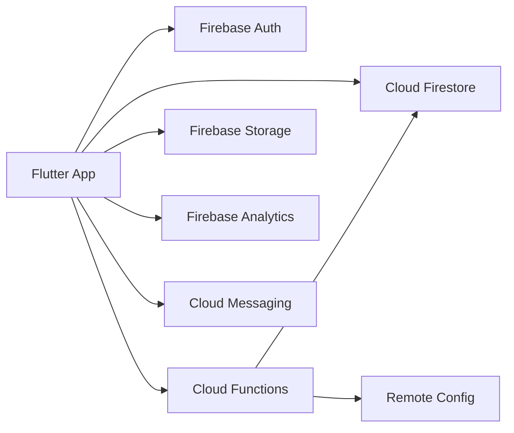
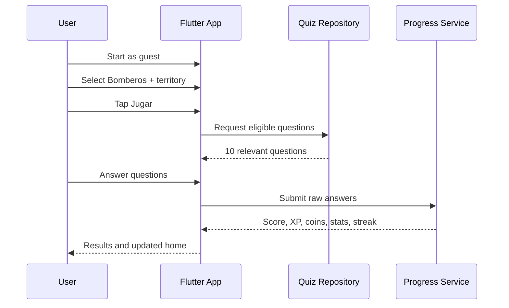

# Architecture

## What Exists And What Is Reused

Automatic repository inspection is currently blocked by the Windows sandbox process launcher (`CreateProcessAsUserW failed: 5`). Because of that, this baseline is added conservatively as new files and avoids overwriting existing files. If a Flutter project already exists, the intended reusable pieces are:

- Existing Flutter app bootstrap, if present.
- Existing Firebase configuration files, if present.
- Existing assets and branding, if present.
- Existing test setup, if present.

## Product Architecture

OpoCompit is built as a Flutter client with Firebase as the backend authority. The client is optimized for fast entry into useful study gameplay; Firebase validates competitive and economic outcomes.



## Project Structure

```text
lib/
  app/
    app.dart
    router.dart
  core/
    design/
    domain/
    utils/
  features/
    onboarding/
    home/
    quiz/
    results/
    profile/
    admin/
  shared/
```

## Feature Boundaries

- `onboarding`: guest start, opposition selection, territory selection.
- `home`: game-first dashboard, streak, XP, currencies, main CTA.
- `quiz`: question eligibility, answer flow, local session state.
- `results`: scoring, XP, coins, streak updates, review.
- `profile`: aggregate progress and public player identity.
- `admin`: import format and question management surface, initially documented and scaffold-ready.

## Client Vs Server Responsibility

Client may:

- Render questions and answers.
- Keep temporary offline quiz session state.
- Submit raw answer attempts.
- Display derived progress returned by trusted services.

Server must:

- Validate quiz session ownership and question eligibility.
- Score official and competitive results.
- Award XP, coins, gems, achievements, missions, streaks, and rankings.
- Validate purchases, subscriptions, premium status, and inventory.
- Maintain anti-cheat transaction logs.

## Vertical Slice Flow



