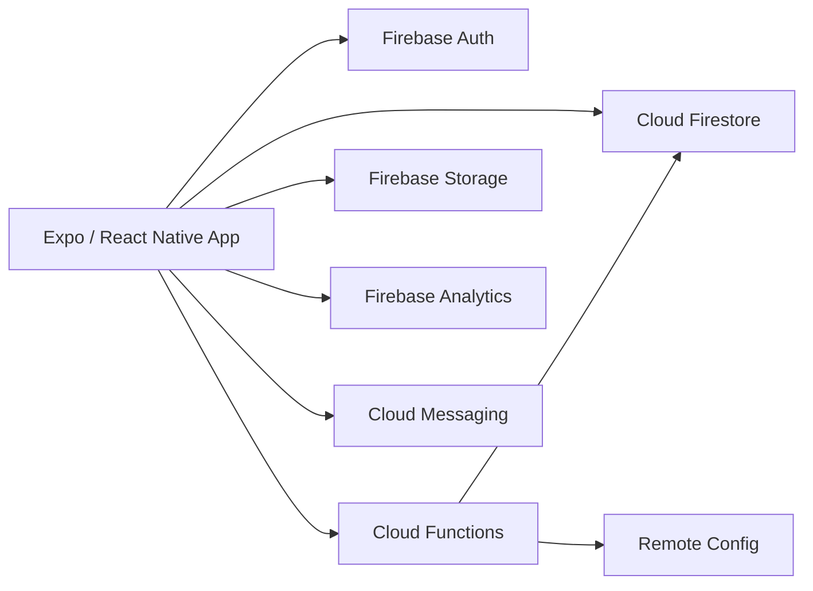
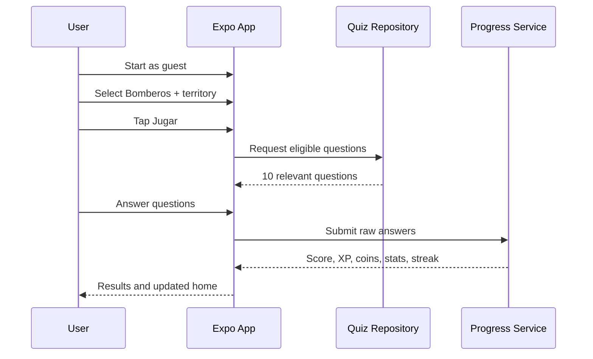

# Architecture

## What Exists And What Is Reused

- Firestore rules, indexes, Firebase project configuration, and Cloud Functions are shared by the React client.
- Product models and local gameplay rules are being ported from Flutter to TypeScript.
- The Flutter client remains available as a reference during migration.

## Product Architecture

OpoCompit uses one Expo/React Native client for Android and web, with Firebase as the backend authority. The client is optimized for fast entry into useful study gameplay; Firebase validates competitive and economic outcomes.


```mermaid
flowchart LR
  App["Expo / React Native App"] --> Auth["Firebase Auth"]
  App --> Firestore["Cloud Firestore"]
  App --> Functions["Cloud Functions"]
  App --> Storage["Firebase Storage"]
  App --> Analytics["Firebase Analytics"]
  App --> FCM["Cloud Messaging"]
  Functions --> Firestore
  Functions --> RemoteConfig["Remote Config"]
```

## Project Structure

```text
apps/client/
  app/                 # Expo Router screens
  src/
    core/              # domain, design, Firebase
    features/          # feature state, rules, and data
    shared/            # reusable UI
functions/             # trusted Firebase backend
```

## Feature Boundaries

- `onboarding`: guest start, opposition selection, territory selection.
- `home`: game-first dashboard, streak, XP, currencies, main CTA.
- `quiz`: question eligibility, answer flow, local session state.
- `results`: scoring, XP, coins, streak updates, review.
- `profile`: aggregate progress and public player identity.
- `groups`: private memberships, join codes, and live member XP ranking through callable Functions.
- `admin`: import format and question management surface, initially documented and scaffold-ready.

## Client Vs Server Responsibility

Client may:

- Render questions and answers.
- Keep temporary offline quiz session state.
- Submit raw answer attempts.
- Display derived progress returned by trusted services.

Server must:

- Validate quiz session ownership and question eligibility.
- Score official and competitive results.
- Award XP, coins, gems, achievements, missions, streaks, and rankings.
- Validate purchases, subscriptions, premium status, and inventory.
- Maintain anti-cheat transaction logs.

## Vertical Slice Flow


```mermaid
sequenceDiagram
  participant U as User
  participant A as Expo App
  participant R as Quiz Repository
  participant P as Progress Service
  U->>A: Start as guest
  U->>A: Select Bomberos + territory
  U->>A: Tap Jugar
  A->>R: Request eligible questions
  R-->>A: 10 relevant questions
  U->>A: Answer questions
  A->>P: Submit raw answers
  P-->>A: Score, XP, coins, stats, streak
  A-->>U: Results and updated home
```
